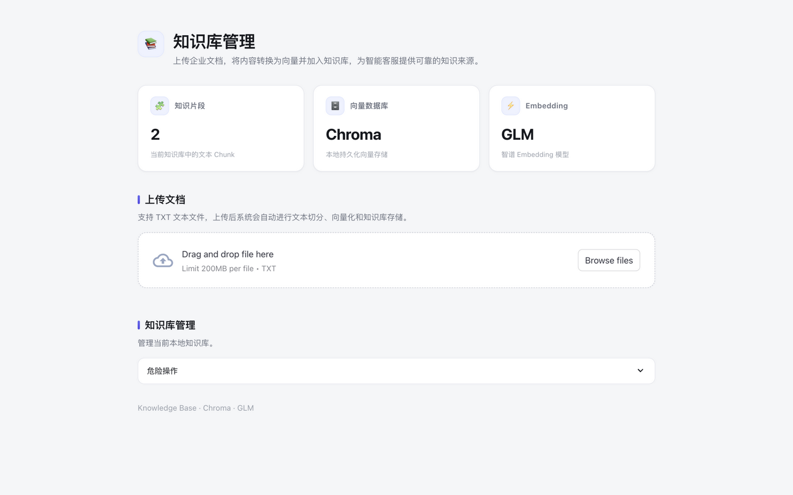
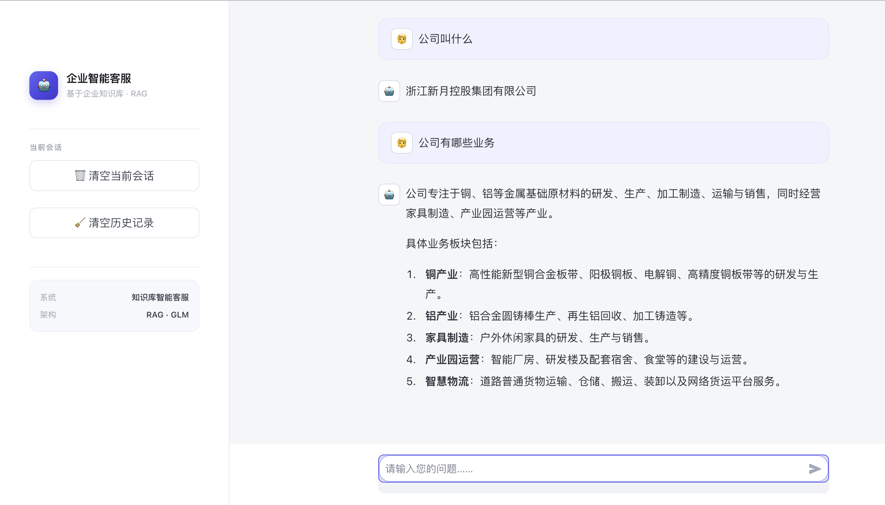
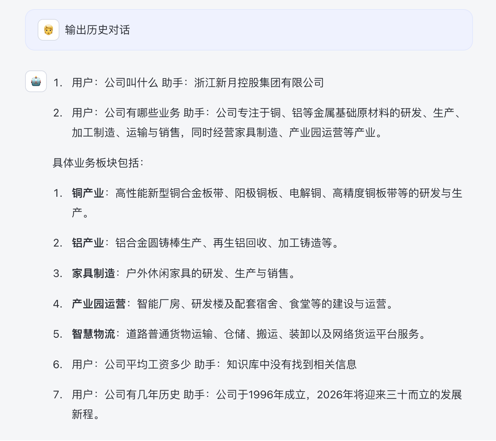

# RAG-LLM-System

基于 **Streamlit** 的本地知识库上传与 **RAG** 问答系统（智谱 GLM 版）

适合作为本地知识库问答与 RAG 检索增强的入门实践项目：

- 在网页端上传 `txt` 文件，自动切分并向量化写入本地 Chroma 向量库
- 在网页端以聊天形式提问，先检索知识库，再由 GLM 结合检索结果**流式**回答
- 支持多轮对话记忆、历史记录查询、MD5 内容去重
- 统一的浅色 + 靛蓝现代主题界面（基于 Streamlit 深度定制样式）

技术栈：**Python 3.10+ / Streamlit / LangChain 0.1.x / Chroma / 智谱 GLM（glm-4.5 + embedding-3）**

---

## 🖼 界面预览

**知识库管理**（上传文档、查看统计、清空知识库）：

<div align="left">
  
</div>

**企业智能服务**（基于知识库的 RAG 流式问答）：

<div align="left">
  
</div>

**历史对话查询**（可让客服输出之前的全部问答记录）：

<div align="left">
  
</div>

---

## ✨ 功能一览

### 1) 知识库管理（`app_upload.py`）

- 网页上传 TXT 文件（UTF-8 / GBK 编码自动兼容），展示文件类型、大小、字符数与内容预览
- 使用 `RecursiveCharacterTextSplitter` 按配置切分（默认 `chunk_size=1000`、`overlap=100`，分隔符针对中英文优化）
- **MD5 去重**：相同内容不会重复入库，重复上传会明确提示
- 写入本地持久化 Chroma（`chroma_db/`），页面实时统计知识片段数量
- 「危险操作」区支持两步确认清空整个知识库（同时清除 MD5 记录）

### 2) 企业智能服务（`app_chat.py`）

- Streamlit 聊天界面，回答**流式输出**（边生成边显示）
- RAG 流水线：知识库相似度检索 Top-3 → 组装 Prompt → GLM 生成 → 流式解析
- 多轮对话记忆（会话内），支持「输出所有历史对话」等历史查询意图
- 系统提示词内置约束：知识库问题优先查资料、历史问题优先查记录、找不到不编造
- 侧栏支持「清空当前会话」（仅清页面消息）与「清空历史记录」（清后端记忆）

---

## 🏗 系统架构

```text
浏览器（Streamlit 页面）
│
├─ app_upload.py  知识库管理页面 ──→ knowledge_base.py 知识库服务
│                                      ├─→ vector_stores.py ──→ chroma_db/（本地持久化）
│                                      └─→ glm_models.py ────→ 智谱 embedding-3（向量化）
│
└─ app_chat.py  智能服务页面 ──→ rag.py RAG 服务
                                   ├─→ vector_stores.py（相似度检索 Top-3）
                                   ├─→ file_history_store.py（内存会话历史）
                                   └─→ glm_models.py ────→ 智谱 glm-4.5（流式生成）

config_data.py（全局配置：路径、chunk 参数、模型名、session_id）
```

分层说明：

| 层 | 文件 | 职责 |
|---|---|---|
| UI 层 | `app_upload.py` / `app_chat.py` | Streamlit 页面与交互 |
| 业务层 | `knowledge_base.py` / `rag.py` | 去重切分入库 / RAG 链组装 |
| 基础设施层 | `vector_stores.py` / `glm_models.py` / `file_history_store.py` | Chroma 封装 / 智谱 API 适配 / 内存历史 |
| 配置 | `config_data.py` + `.env` | 路径、参数、模型名 / API Key |

---

## 🧩 项目结构

```text
RAG-LLM-System/
├─ app_upload.py           # 知识库管理页面（上传 / 统计 / 清空）
├─ app_chat.py             # 智能服务页面（RAG 流式问答）
├─ knowledge_base.py       # 知识库服务：MD5 去重、文本切分、构造 Document、入库
├─ rag.py                  # RAG 链：检索 → Prompt → GLM → 历史管理
├─ vector_stores.py        # Chroma 封装（增 / 检索 / 计数 / 清空）
├─ glm_models.py           # 智谱 GLM 适配（OpenAI 兼容方式调用）
├─ file_history_store.py   # 会话历史存储（内存字典实现）
├─ config_data.py          # 全局配置
├─ requirements.txt        # 依赖清单
├─ .env                    # 环境变量（ZHIPUAI_API_KEY）
├─ .streamlit/
│  └─ config.toml          # Streamlit 主题配置（界面强调色）
├─ md5.text                # MD5 去重记录（运行时自动生成）
├─ chroma_db/              # Chroma 持久化数据（运行时自动生成）
└─ assets/
   ├─ ui_upload.png        # 知识库管理页截图
   ├─ ui_chat.png          # 智能服务页截图
   └─ 企业信息.txt          # 示例语料（可直接上传测试）
```

---

## 🚀 快速开始

### 1) 环境准备

```bash
# 进入项目目录，创建并激活虚拟环境（建议 Python 3.10+）
python3 -m venv .venv
source .venv/bin/activate          # Windows：.venv\Scripts\activate

# 安装依赖（清华镜像加速）
pip install -r requirements.txt -i https://pypi.tuna.tsinghua.edu.cn/simple
```

### 2) 配置 API Key

在项目根目录创建 `.env` 文件，写入[智谱开放平台](https://open.bigmodel.cn/)的 API Key：

```bash
echo 'ZHIPUAI_API_KEY=你的智谱APIKey' > .env
```

> 缺少该 Key 时服务无法启动，会在启动阶段直接报错提示。

### 3) 启动服务

两个页面是两个独立的 Streamlit 应用，需要分别启动（开两个终端）：

```bash
# 终端 1：知识库管理页（默认 8501 端口）
streamlit run app_upload.py

# 终端 2：智能服务页（用 8502 端口避免冲突）
streamlit run app_chat.py --server.port 8502
```

### 4) 开始使用

1. 打开 <http://localhost:8501>，上传 `assets/企业信息.txt`（示例语料）
2. 打开 <http://localhost:8502>，提问，例如：
   - 公司有哪些产业？
   - 公司在哪里设有生产基地？
3. 知识库中有对应内容时，回答基于语料生成；没有相关内容时，系统会如实回答「知识库中没有找到相关信息」，不会编造。

---

## ⚙️ 配置说明

### `.env`

| 变量 | 必填 | 说明 |
|---|---|---|
| `ZHIPUAI_API_KEY` | ✅ | 智谱开放平台 API Key，用于调用 glm-4.5 与 embedding-3 |

### `config_data.py`

| 参数 | 默认值 | 说明 |
|---|---|---|
| `collection_name` | `rag` | Chroma 集合名 |
| `persist_directory` | `./chroma_db` | 向量库持久化目录（基于项目根目录解析，任意位置启动均有效） |
| `md5_path` | `./md5.text` | MD5 去重记录文件 |
| `chunk_size` / `chunk_overlap` | 1000 / 100 | 文本切分的块大小与相邻块重叠 |
| `max_spliter_char_number` | 1000 | 不超过该长度的文本整体入库、不再切分 |
| `similarity_threshold` | 3 | 每次提问检索返回的片段数 k |
| `embedding_model_name` | `embedding-3` | 智谱向量模型 |
| `chat_model_name` | `glm-4.5` | 智谱对话模型（代码内写死，修改需同步 `glm_models.py`） |
| `session_id` | `user_001` | 会话 ID（当前为单用户固定值） |

---

## 🛠 常见问题（FAQ）

### Q1：启动报错「没有找到 ZHIPUAI_API_KEY」

`.env` 文件不存在、不在项目根目录，或其中没有 `ZHIPUAI_API_KEY`。按「快速开始 → 配置 API Key」补齐即可。

### Q2：上传文档成功，但提问回答「知识库中没有找到相关信息」

两种可能：

1. **语料中确实没有相关内容**——系统遵循"不编造"规则，会如实回答；
2. **上传后没有重启智能服务**——Chroma 0.4.x 的长驻进程不会自动感知其他进程新写入的数据，`streamlit run app_chat.py` 是在入库之前启动的话，需要重启该服务后新内容才能被检索到。

### Q3：首次上传 / 首次提问响应较慢

首次请求需要建立向量索引并调用智谱 API（向量化 + 对话），受网络影响较大，属正常现象。

### Q4：页面自定义样式错乱或部分隐藏元素又出现了

本项目样式基于 **Streamlit 1.39** 的页面结构（`data-testid` 选择器）定制，请使用 `requirements.txt` 约束的版本（1.35–1.40）。

### Q5：安装依赖时 numpy 相关报错

Chroma 0.4.x 尚不兼容 numpy 2.x，`requirements.txt` 已锁定 `numpy<2.0`，请勿手动升级。

### Q6：清空当前会话与清空历史记录有什么区别？

- 「清空当前会话」：只清空页面显示的消息，后端记忆保留；
- 「清空历史记录」：同时清空后端会话记忆，模型不再记得之前的对话。
- 两者都只影响**内存中的会话**，服务重启后历史自动清空（不影响知识库）。

---

## 📌 已知限制

- 仅支持 TXT 文件上传（其他格式的解析依赖已备好，尚未接入）
- 单用户固定会话（`session_id=user_001`），无登录与多用户隔离
- 会话历史保存在内存中，服务重启即清空
- 上传新文档后需重启智能服务才能检索到（见 FAQ Q2）

## ✨ 优化方向（仅供参考）

- 接入 PDF / Word / Excel / Markdown 解析（`pypdf`、`python-docx`、`openpyxl` 已列入可选依赖）
- 会话历史持久化（替换为 `FileChatMessageHistory` / Redis，当前为内存实现）
- 多用户会话：将固定 `session_id` 改为按浏览器会话生成 UUID
- 检索质量优化：Rerank 重排、混合检索、调整检索 k 值
- 更换向量库（FAISS / Milvus）或模型供应商：`glm_models.py` 集中封装了模型接入，改 `base_url` 与模型名即可切换其他 OpenAI 兼容服务

---

## 📄 License

[MIT](./LICENSE)。本项目仅用于学习与交流，如需商用请自行补全安全、合规与授权相关内容。

## 🙌 致谢

- Black Horse
- Streamlit
- LangChain
- Chroma / chromadb
- 智谱 AI（Zhipu AI）
